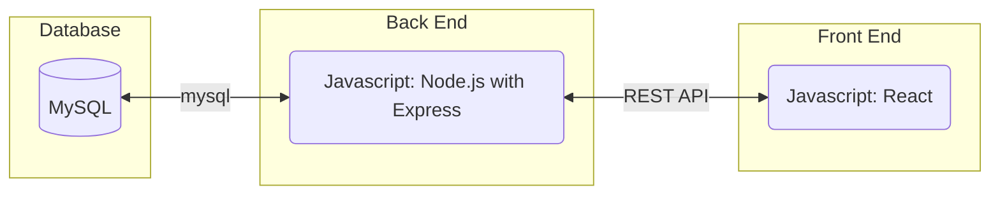
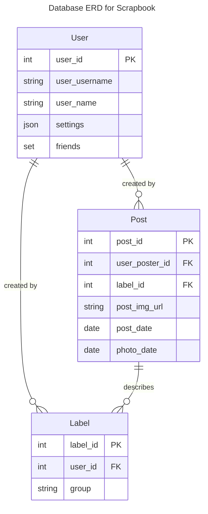
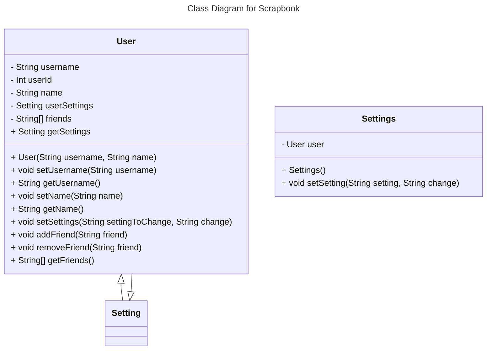
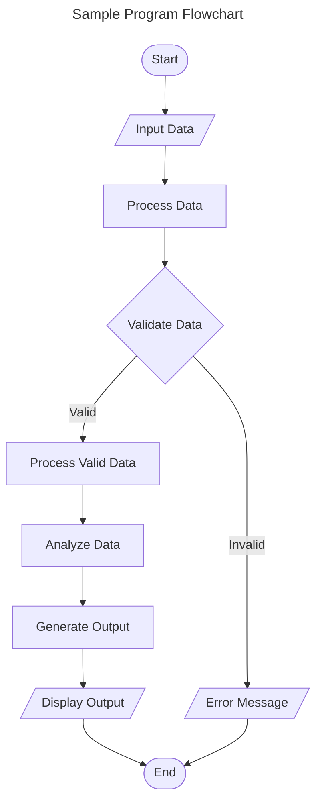
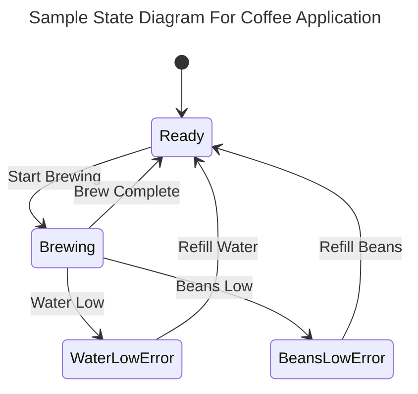
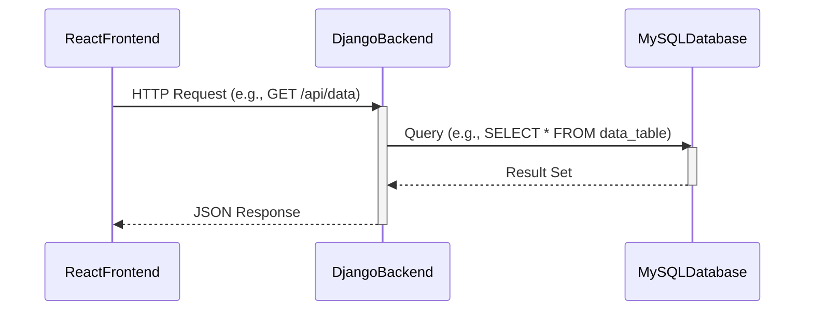

# Requirements and Specification Document

### Project Abstract

Scrapbook is a photo storage and sharing app that simulates a virtual "scrapbook." Users can upload and categorize photos. They can add "friends" who can view their photos and whose photos they can view, but unlike a standard photo sharing app like Instagram, the purpose of Scrapbook is to encourage users to seek out each others' content. There is no "feed" and no notifications of new posts or engagement, nor the standard social media features of likes and comments. The emphasis is on recording your own photos and memories that others can view as they like.

### User Requirements

- Users can upload their own photos
   - Photos can be categorized by time period or by a custom "label" for given events, people, time periods etc.
        - Custom labels can be grouped to change how a user's scrapbook is portrayed
    - Users can customize how their scrapbook is displayed (photo style, layout style etc) from a set of options
    - Users can set a "starting point" for their scrapbook within any of their custom labels/label groups
- Users can friend other users
    - This allows them to view their friends' scrapbooks, and their friends can view their scrapbooks
        - Scrapbooks are displayed based off of how the owner chooses to display them - the view cannot be customized by other users
    - Users can engage each other in an individual or group private DM, either about a specific photo or group, or just generally
    - There is no feed of friends' photos. Users can go to a friends page where their friends' scrapbooks are accessible from a "coffee table", and go through any given friends' scrapbook.

### User Interface Requirements

Images can be included with ``

### Security Requirements

Users must log in to their own account using some sort of other SSO - Google, Instagram etc. For security reasons, the initial version of the app will not have its own homebuilt login.

### System Requirements

The app can load a scrapbook in reasonable time (a set of at least 10 images at a time). A user needs to be able to store at least 10,000 photos in their account. The system will initially only be available in web browser, but will eventually be available for mobile browser and as a mobile app

### Specification

<!--A detailed specification of the system. UML, or other diagrams, such as finite automata, or other appropriate specification formalisms, are encouraged over natural language.-->

<!--Include sections, for example, illustrating the database architecture (with, for example, an ERD).-->

<!--Included below are some sample diagrams, including some example tech stack diagrams.-->

#### Technology Stack

#### Database

#### Class Diagram

#### Flowchart

#### Behavior

#### Sequence Diagram

### Standards & Conventions

<!--Here you can document your coding standards and conventions. This includes decisions about naming, style guides, etc.-->
